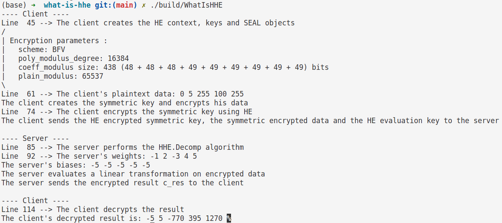

# What is Hybrid Homomorphic Encryption
Demonstration code for the blog post [what is hybrid homomorphic encryption](https://encryptedlearner.com/what-is-hybrid-homomorphic-encryption-and-its-applications-b0568b21954c).

## Requirements
`cpp==9.4.0`   
`CMAKE>=3.13`  
`SEAL==4.0.0`  

## Running
- `cmake -S . -B build -DCMAKE_PREFIX_PATH=libs/seal`  
Here, `-DCMAKE_PREFIX_PATH` specifies the path to the installed SEAL library.
- `cmake --build build`
- Run the compiled binary, for example `./build/WhatIsHHE`

An example output is as follows:

